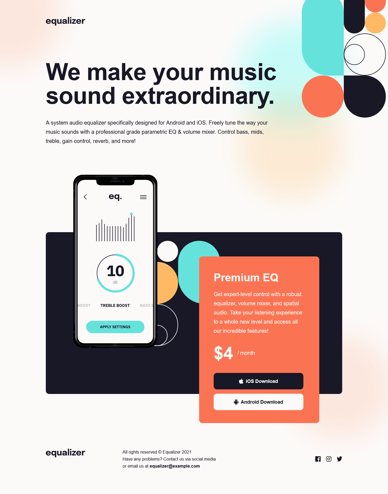

# Frontend Mentor - Equalizer landing page solution

This is a solution to the [Equalizer landing page challenge on Frontend Mentor](https://www.frontendmentor.io/challenges/equalizer-landing-page-7VJ4gp3DE). Frontend Mentor challenges help you improve your coding skills by building realistic projects.

## Table of contents

- [Overview](#overview)
  - [Screenshot](#screenshot)
  - [Links](#links)
- [My process](#my-process)
  - [Built with](#built-with)
  - [Continued development](#continued-development)
- [Author](#author)

## Overview

### Screenshot

### Links

- Solution URL: <https://github.com/codepalacios/equalizer-landing-page>
- Live Site URL: <https://codepalacios.github.io/equalizer-landing-page/>

## My process

### Built with

- Semantic HTML5 markup
- CSS custom properties
- Flexbox
- CSS Grid
- Mobile-first workflow

### Continued development

I'll focus on accessibility, media queries, and using the position property. The main objective is to develop websites that do not have problems with the configurations used by users.

## Author

- GitHub - [@codepalacios](https://github.com/codepalacios)
- Frontend Mentor - [@codepalacios](https://www.frontendmentor.io/profile/codepalacios)
